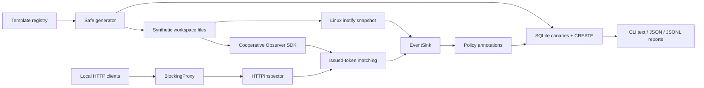

# Architecture

AgentCanary separates artifact creation, observation, matching, policy, persistence, and reporting. Each adapter describes the evidence it can actually observe; adapters do not promote guesses into process attribution.

The HTTP listener has no upstream forwarding path. SDK observation methods inspect supplied input; the application remains responsible for its own tool and network calls.

## Modules

| Module | Responsibility |
| --- | --- |
| `models` | Immutable canary/event records, identifiers, timestamps, bounded metadata |
| `templates` | Built-in synthetic artifacts and inert custom-template rendering |
| `filesystem`, `generator` | Exclusive creation, directory-relative path safety, batch preflight and cleanup |
| `store` | Canary registry, atomic creation evidence, ordered event persistence and queries |
| `matching` | Exact issued-marker matching and bounded representation decoding |
| `sdk` | Explicit read, copy, tool, HTTP and model-input observations with caller attribution |
| `monitors.inotify` | Unprivileged Linux access notifications and coverage-health events |
| `network` | HTTP input inspection and the loopback blocking endpoint |
| `policy` | Validated operator policy and retained event annotations |
| `protocols` | Small `EventSink` and `Monitor` extension contracts |
| `report`, `cli` | User-facing commands and token-redacted report rendering |
| `demo` | Installed simulated-agent acceptance flow and owned process-group cleanup |

## Canary identity

Every canary has a UUID, a separate randomly generated 128-bit token, a type, an artifact path, a content digest, and a creation timestamp. The marker starts with `AGENTCANARY_SYNTHETIC_`. It remains the correlation value when copied away from its original path. Detection compares against the issued registry, not a generic credential pattern.

Artifact values are deliberately invalid credentials. The registry stores synthetic markers, but event evidence and default reports omit artifact contents. A template may repeat its marker in several sensitive-looking fields so those fields remain correlatable independently. Arbitrary literal data without an issued marker is outside detection.

## Evidence model

Actions are `CREATE`, `READ`, `COPY`, `TOOL_USE`, `MODEL_REQUEST`, `EXFILTRATION`, and `MONITOR_HEALTH`. A record contains an event UUID, timestamp, canary ID when applicable, action, source, provenance, optional run ID/PID/destination, and bounded scalar metadata. Reports join the registry to expose `canary_type`.

The database assigns an ingestion sequence. This gives stable report ordering across concurrent writers without assuming that clocks or asynchronous sensors establish causality. Run IDs are correlation labels, not authenticated identities. Two adapters observing the same read can legitimately produce two records.

`MONITOR_HEALTH` records explain gaps and lifecycle changes. A ready monitor can have zero or incomplete coverage; callers must inspect watch counts and diagnostics. A failed custom sink is surfaced to the caller or monitor owner. AgentCanary cannot persist a diagnostic through a sink that is itself unavailable.

## Persistence and creation

SQLite uses a private state directory and database file, foreign keys, a schema/application identifier, WAL, FULL synchronization, a busy timeout, and short-lived connections. Registry batches and their CREATE events commit together. Parameterized SQL keeps values separate from queries. Unknown schema versions and unrelated databases are rejected before persistent configuration changes.

Creation validates every destination before writing. It uses exclusive file opens and no-follow directory descriptors, reserves cleanup handles before mutations, and preserves existing content. Filesystem writes and database commits cannot form one atomic transaction. Routine failures trigger best-effort rollback; abrupt termination or failed cleanup operations may leave unregistered files. The operator can inspect and remove those synthetic leftovers explicitly.

The local store uses Linux `/proc/self/fd` to pin the selected directory while SQLite opens its files. Linux with a mounted proc filesystem is the supported release platform. Porting storage/path handling requires a platform-specific adapter; the package does not claim Windows or macOS support.

## Observation lifecycles

`Observer` snapshots the registry at construction. `refresh()` explicitly updates matching. It records actual caller PID and describes completed reads/copies or supplied tool/model input. Its tool wrapper uses argument arrays with `shell=False`, a timeout, and discarded output. A tool-input event is not proof of child consumption.

`InotifyMonitor.start()` validates registered artifacts before installing watches, then returns after readiness. It never rereads watched contents for validation. Access notifications have unknown PID. Changes, lost watches, and overflow invalidate coverage; stop/start creates a new validated snapshot. Metadata checks reduce ordinary replacement races but do not establish a sandbox boundary against a hostile process with the same account.

The passive adapter supports one registered canary per watched inode. A duplicate registration is explicitly rejected for that run with `duplicate_inode` health evidence; the original watch is retained. The SDK matcher can still identify multiple issued markers in a payload. Passive monitoring does not automatically discover arbitrary copied files.

`BlockingProxy` exposes a local lifecycle and request-inspection boundary. It blocks all upstream attempts, including policy matches. Its PID field is unknown because a TCP request does not identify the sending process. Client-supplied identity headers are not trusted.

The demo runs a controlled Python child in its own session. That disposable child acts as a Linux subreaper to collect owned tool descendants during failure cleanup. This is demonstration lifecycle machinery; it does not alter the SDK caller's process-wide child-reaping policy or provide hostile-process containment.

## Extension points

- Implement `EventSink.record(event) -> Event` for another sink or a policy wrapper. Document durability, ordering, and failure semantics; omit raw payloads from event metadata.
- Implement `Monitor.start()` and `stop()` for a new sensor, preserving shared IDs and explicit provenance. Emit health evidence when coverage is degraded.
- Use `SeedSpec` and custom text templates to add artifact layouts. Templates substitute `$token`, `$canary_id`, and `$label`; they execute no code.
- Use SDK observations around a tool/model integration's actual input. Keep observation separate from sending, and identify whether the evidence is an attempt, completed read, or supplied input.
- A future auditd/eBPF backend can add stronger process attribution while declaring its privilege and loss requirements. The baseline does not require either backend.

See [the threat model](threat-model.md) for trust assumptions and [limitations](limitations.md) for operational gaps.
